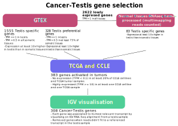

```{r style, echo = FALSE, results = 'asis'}
BiocStyle::markdown()
```

# Introduction

`CTdata` is the companion Package for `CTexploreR` and provides omics
data to select and characterise cancer testis genes. Data come from
public databases and include expression and methylation values of
genes in normal and tumor samples as well as in tumor cell lines, and
expression in cells treated with a demethylating agent is also
available.

The data are served through the `ExperimentHub` infrastructure, which
allows download them only once and cache them for further
use. Currently available data are summarised in the table below and
details in the next section.

```{r data}
library("CTdata")
DT::datatable(CTdata())
```

# Installation

To install the package:

```{r install1, eval = FALSE}
if (!require("BiocManager"))
    install.packages("CTdata")

BiocManager::install("CTdata")
```

To install the package from GitHub:

```{r install2, eval = FALSE}
if (!require("BiocManager"))
    install.packages("BiocManager")

BiocManager::install("UCLouvain-CBIO/CTdata")
```

# Available data

For details about each data, see their respective manual pages.

## Global datasets

### GTEX data

A `SummarizedExperiment` object with gene expression data in normal
tissues from GTEx database:

```{r, message = FALSE}
library("SummarizedExperiment")
```

```{r}
GTEX_data()
```

### CCLE data

A `SummarizedExperiment` object with gene expression data in cancer
cell lines from CCLE:

```{r}
CCLE_data()
```


### Normal tissue gene expression

A `SummarizedExperiment` object with gene expression values in normal
tissues with or without allowing multimapping:

```{r}
normal_tissues_multimapping_data()
```

### Demethylated gene expression

A `SummarizedExperiment` object containing genes differential
expression analysis (with RNAseq expression values) in cell lines
treated or not with a demethylating agent (5-Aza-2'-Deoxycytidine).

```{r}
DAC_treated_cells()
```

As above, with multimapping:

```{r}
DAC_treated_cells_multimapping()
```

### TCGA data

A `SummarizedExperiment` with gene expression data in TCGA samples
(tumor and peritumoral samples : SKCM, LUAD, LUSC, COAD, ESCA, BRCA
and HNSC):

```{r}
TCGA_TPM()
```


### Testis scRNAseq data

A `SingleCellExperiment` object containing gene expression from testis
single cell RNAseq experiment (*The adult human testis transcriptional
cell atlas* (Guo et al. 2018)):

```{r, message = FALSE}
library("SingleCellExperiment")
```

```{r}
testis_sce()
```


### Human Protein Atlas data

A `SingleCellExperiment` object containing gene expression in different human
cell types based on scRNAseq data obtained from the Human Protein Atlas
(https://www.proteinatlas.org)/

```{r}
scRNAseq_HPA()
```

## CT genes determination

```{r, echo = FALSE}
ctgenes <- CT_genes()
n <- nrow(ctgenes)
```


With the datasets above, we generated a list of `r n` CT genes (see
figure below for details).

We used multimapping because many CT genes belong to gene families
from which members have identical or nearly identical sequences. This
is likely the reason why these genes are not detected in GTEx
database, as GTEx processing pipeline specifies that overlapping
intervals between genes are excluded from all genes for counting. Some
CT genes can thus only be detected in RNAseq data in which
multimapping reads are not discarded.

```{r, echo=FALSE, fig.align='center', out.width = '100%'}

```


## CT datasets

### Metylation in normal tissue

A `RangedSummarizedExperiment` containing methylation of CpGs located
within CT promoters in normal tissues:

```{r}
CT_methylation_in_tissues()
```

A `SummarizedExperiment` with Cancer-Testis genes' promoters mean
methylation in normal tissues:

```{r}
CT_mean_methylation_in_tissues()
```

### TCGA data

A `SummarizedExperiment` with gene expression data in TCGA samples
(tumor and peritumoral samples : SKCM, LUAD, LUSC, COAD, ESCA, BRCA
and HNSC):


```{r}
TCGA_CT_methylation()
```

### CCLE data

A `matrix` with gene expression correlations in CCLE cancer cell lines:

```{r}
dim(CCLE_correlation_matrix())
CCLE_correlation_matrix()[1:10, 1:5]
```


### CT genes

A `tibble` with Cancer-Testis (CT) genes and their characteristics:

```{r}
CT_genes()
```


# Session information {-}

```{r sessioninfo, echo=FALSE}
sessionInfo()
```
