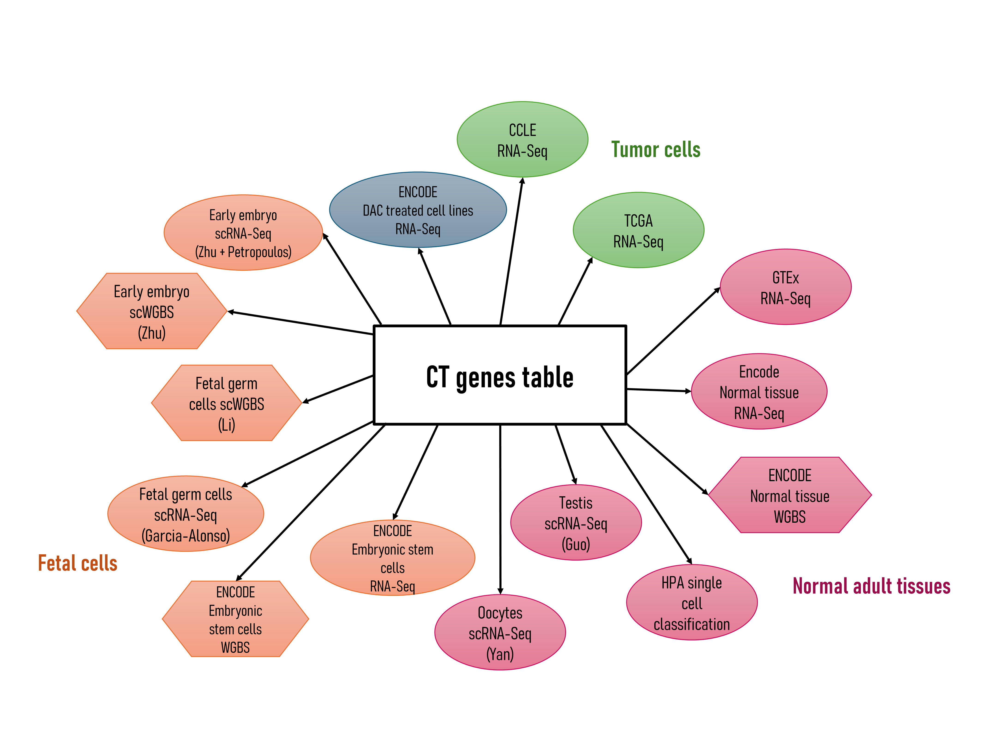
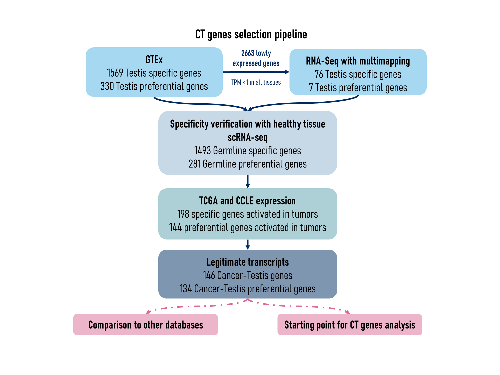

```{r style, echo = FALSE, results = 'asis'}
BiocStyle::markdown()
```

# Introduction

`CTdata` is the companion Package for `CTexploreR` and provides omics
data to select and characterise cancer testis genes. Data come from
public databases and include expression and methylation values of
genes in normal, fetal and tumor samples as well as in tumor cell lines, and
expression in cells treated with a demethylating agent is also
available.

The data are served through the `ExperimentHub` infrastructure, which
allows download them only once and cache them for further
use. Currently available data are summarised in the table below and
details in the next section.

```{r data}
library("CTdata")
DT::datatable(CTdata())
```

# Installation

To install the package:

```{r install1, eval = FALSE}
if (!require("BiocManager"))
    install.packages("CTdata")

BiocManager::install("CTdata")
```

To install the package from GitHub:

```{r install2, eval = FALSE}
if (!require("BiocManager"))
    install.packages("BiocManager")

BiocManager::install("UCLouvain-CBIO/CTdata")
```

# Available data

```{r, echo=FALSE, fig.align='center', out.width = '100%'}

```

For details about each data, see their respective manual pages.

## Normal adult tissues

### GTEX data

A `SummarizedExperiment` object with gene expression data in normal
tissues from GTEx database:

```{r, message = FALSE}
library("SummarizedExperiment")
```

```{r}
GTEX_data()
```

### Normal tissue gene expression

A `SummarizedExperiment` object with gene expression values in normal
tissues with or without allowing multimapping:

```{r}
normal_tissues_multimapping_data()
```

### Methylation in normal adult tissues

A `RangedSummarizedExperiment` containing methylation of CpGs located
within gene promoters in normal tissues:

```{r}
methylation_in_tissues()
```

(`CT_methylation_in_tissues` before v 1.5)


A `SummarizedExperiment` with all genes' promoters mean
methylation in normal tissues:

```{r}
mean_methylation_in_tissues()
```

(`CT_mean_methylation_in_tissues` before v 1.5)


### Testis scRNAseq data

A `SingleCellExperiment` object containing gene expression from testis
single cell RNAseq experiment (*The adult human testis transcriptional
cell atlas* (Guo et al. 2018)):

```{r, message = FALSE}
library("SingleCellExperiment")
```

```{r}
testis_sce()
```


### Oocytes scRNAseq data

A `SingleCellExperiment` object containing gene expression from oocytes
single cell RNAseq experiment (Yan et al. 2021):

```{r}
oocytes_sce()
```


### Human Protein Atlas scRNAseq data

A `SingleCellExperiment` object containing gene expression in different human
cell types based on scRNAseq data obtained from the Human Protein Atlas
(https://www.proteinatlas.org)

```{r}
scRNAseq_HPA()
```

### Human Protein Atlas cell type specificity data

A `tibble` object containing cell type specificities based on scRNAseq data 
analysis from the Human Protein Atlas (https://www.proteinatlas.org)

```{r}
HPA_cell_type_specificities()
```

## Fetal cells

### Fetal germ cell scRNAseq data

A `SingleCellExperiment` object containing gene expression from fetal germ cells
single cell RNAseq experiment (*Single-cell roadmap of human gonadal development
*(Garcia-Alonso et al. 2022)):

```{r}
FGC_sce()
```

### Methylation in fetal germ cells (scWGBS)

A `RangedSummarizedExperiment` containing methylation of CpGs (hg19 based) 
located within gene promoters in fetal germ cells (*Dissecting the epigenomic 
dynamics of human fetal germ cell development at single-cell resolution*(Li et 
al. 2021)):

```{r}
methylation_in_FGC()
```

A `SummarizedExperiment` with all genes' promoters mean
methylation in fetal germ cells:

```{r}
mean_methylation_in_FGC()
```

### Embryonic stem cells RNA-Seq data

A `SummarizedExperiment` object with gene expression data in embryonic stem
cells from ENCODE database:

```{r}
hESC_data()
```

### Methylation in embryonic stem cells

A `RangedSummarizedExperiment` containing methylation of CpGs
located within gene promoters in embryonic stem cells from ENCODE

```{r}
methylation_in_hESC()
```

A `SummarizedExperiment` with all genes' promoters mean
methylation in embryonic stem cells:

```{r}
mean_methylation_in_hESC()
```

### Early embryo scRNA-seq data

A `SingleCellExperiment` object containing gene expression from early embryo
single cell RNAseq experiment (Petropulous et al, 2014):

```{r}
embryo_sce_Petropoulos()
```

A `SingleCellExperiment` object containing gene expression from early embryo
single cell RNAseq experiment (Zhu et al, 2018):

```{r}
embryo_sce_Zhu()
```


### Methylation in early embryo 

A `RangedSummarizedExperiment` containing methylation of CpGs (hg19 based) 
located within gene promoters in early embryo (*Single Cell DNA Methylome 
Sequencing of Human Preimplantation Embryos* (Zhu et al. 2018)):

```{r}
methylation_in_embryo()
```

A `RangedSummarizedExperiment ` with all genes' promoters mean
methylation in early embryo:

```{r}
mean_methylation_in_embryo()
```


## Demethylated gene expression

A `SummarizedExperiment` object containing genes differential
expression analysis (with RNAseq expression values) in cell lines
treated or not with a demethylating agent (5-Aza-2'-Deoxycytidine).

```{r}
DAC_treated_cells()
```

As above, with multimapping:

```{r}
DAC_treated_cells_multimapping()
```

## Tumor cells

### CCLE data

A `SummarizedExperiment` object with gene expression data in cancer
cell lines from CCLE:

```{r}
CCLE_data()
```

Also, a `matrix` with gene expression correlations in CCLE cancer cell lines:

```{r}
dim(CCLE_correlation_matrix())
CCLE_correlation_matrix()[1:10, 1:5]
```

### TCGA data

A `SummarizedExperiment` with gene expression data in TCGA samples
(tumor and peritumoral samples : SKCM, LUAD, LUSC, COAD, ESCA, BRCA
and HNSC):

```{r}
TCGA_TPM()
```

Also, a `SummarizedExperiment` with gene promoters methylation data in TCGA 
samples (tumor and peritumoral samples : SKCM, LUAD, LUSC, COAD, ESCA, BRCA
and HNSC):


```{r}
TCGA_methylation()
```


(`TCGA_CT_methylation` before v 1.5)


## CT genes determination

### All genes

```{r, echo = FALSE}
all_genes <- all_genes()
n <- nrow(all_genes)
```

The analysis for all genes can be found in `all_genes`, a tibble like `CT_genes` 
containing all `r n` genes characterisation. 

```{r}
all_genes()
```


###  CT genes 

```{r, echo = FALSE}
ctgenes <- CT_genes()
n <- nrow(ctgenes)
```

With the datasets above, we generated a list of `r n` CT and CTP genes (see
figure below for details).

We used multimapping because many CT genes belong to gene families
from which members have identical or nearly identical sequences. This
is likely the reason why these genes are not detected in GTEx
database, as GTEx processing pipeline specifies that overlapping
intervals between genes are excluded from all genes for counting. Some
CT genes can thus only be detected in RNAseq data in which
multimapping reads are not discarded.

```{r, echo=FALSE, fig.align='center', out.width = '100%'}

```


A `tibble` with Cancer-Testis (CT) genes and their characteristics:

```{r}
CT_genes()
```


# Session information {-}

```{r sessioninfo, echo=FALSE}
sessionInfo()
```
